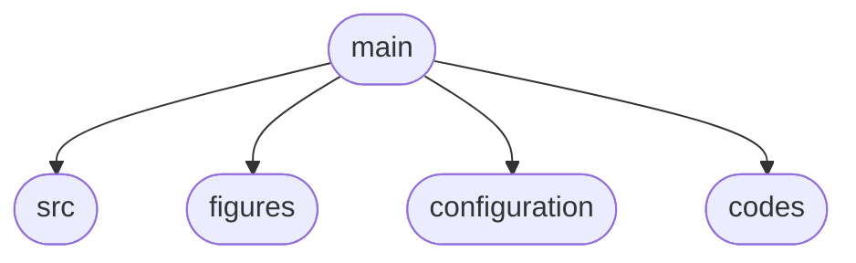

This repo contains my dissertation 

To compile the dissertation, please run `compile.sh`
The bash script will update or initialize the submodule if needed, 
compile the dissertation and remove
all temporary files only leaving the `*.tex` and `*.pdf`

The dissertation is structured as follows:

- **src:** contains appendices, glossaries, and all the chapters
- **figures:** contains all the figures and it is structured by chapter
- **configuration:** contains the preamble, shortcuts, and a submodule for additional resources
- **codes:** contains all the code that will go in the appendix and the scripts used to generate figures used in this dissertation
