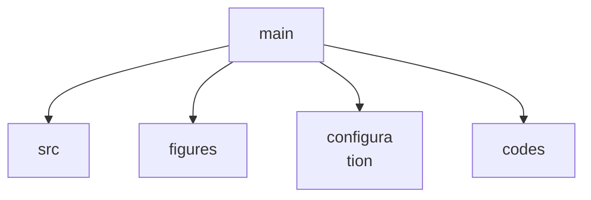

# Dissertation Repository

This repository contains my PhD dissertation. If data is required please reach out.

To compile the dissertation, please run `compile.sh`
The bash script will update or initialize the submodule if needed,
compile the dissertation and remove
all temporary files only leaving the `*.tex` and `*.pdf`

The dissertation is structured as follows:



- **src:** contains appendices, glossaries, and all the chapters
- **figures:** contains all the figures and it is structured by chapter
- **configuration:** contains the preamble, shortcuts, and a submodule for additional resources
- **codes:** contains all the scripts used to generate figures used in this dissertation


# Citation

If you use this dissertation, associated data, figures, or methods, please cite the following work:

```bibtex
@phdthesis{liza2025aerooptical,
  author = {Liza, Martin E.},
  title  = {Aero-Optical Effects in High-Enthalpy Flows},
  year   = {2025},
  school = {University of Arizona},
  type   = {PhD dissertation},
  url    = {https://www.proquest.com/docview/3283728727}
}
```
